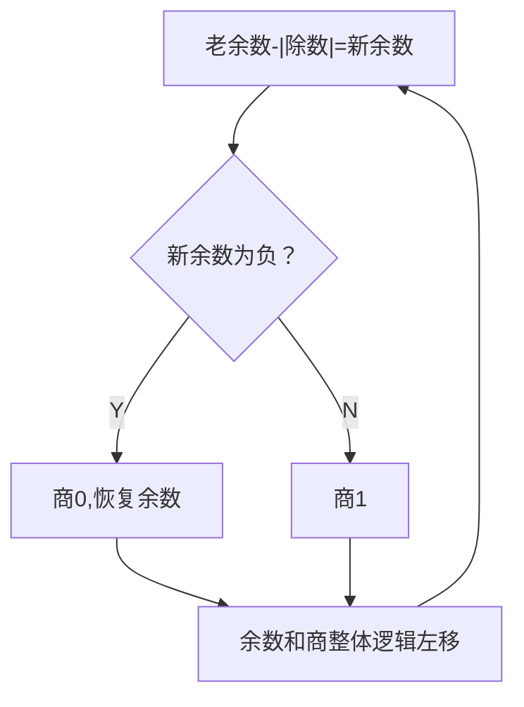
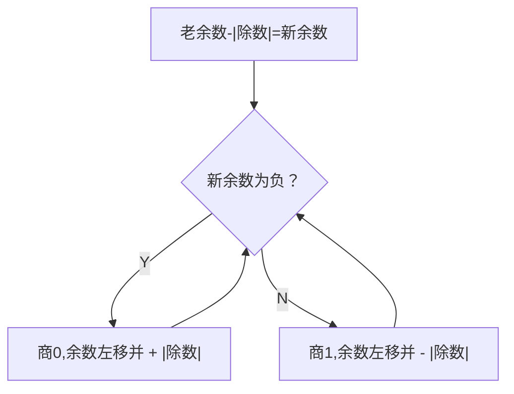

# 原码的除法运算
Top:: [[Computer Compose]]

## 原码除法时运算器的存储
---
![[原码除法中运算器的作用.excalidraw]]

## 除法过程 (恢复余数法)
---
1. ACC 中放入被除数，X 中放入除数，MQ 中置 0
2. MQ 中，最低位（最右边一位）确定商
	1. 一位商要么是 1 要么是 0。计算机会先默认上 1，如果发现余数小于 0，再恢复余数，并把商改为 0（恢复余数法）
		1. 恢复的过程，其实就是把 ACC 的内容再加上一次 X 除数
	2. 商确定为 1 的过程，其实就是用 ACC 内的数减去 X 内的除数，再把结果覆盖到 ACC
3. ACC 和 MQ 整体进行一次逻辑左移
4. 循环 2、3 两步
5. 符号位与数值位分开处理

### 恢复余数法的流程图

## 除法原理 (加减交替法）
---
余数减去除数得到负数的时候，不去恢复余数，而是先逻辑左移余数，然后加上除数

### 推导过程

记一次除法循环中，某次余数减去除数的结果为 a，除数为 b
当 a 为负数的时候，按照恢复余数法，流程如下
1. 先恢复余数 $a + b$
2. 余数逻辑左移 $(a+b)*2$
3. 余数减去除数 $2a+b$

也就是说，商为 0 的时候，不用恢复余数，
而是先进行逻辑左移（得到 2a）
然后再加上除数（2a+b）即可

加/减n+1次,每次加减确定一位商;
左移n次(最后一次加减完不移位)
最终可能还要再多一次加

### 加减交替法的流程图

