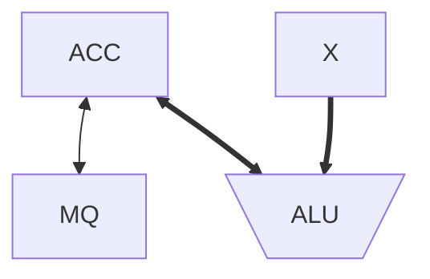

# 各个硬件的工作原理
Top:: [[Computer Compose]]

## 主存储器的基本组成
---
- 主存储器
	- 存储体
	- [[Memory Address Register]]
	- [[Memory Data Register]]

> [!question] 主存储器由哪三个部分构成？
？
> 存储体
> MAR
> MDR

## 运算器的基本组成
---

- ACC(Accumulator): ==累加器,用于存放操作数,或运算结果。==
- MQ(Multiple-Quotient Register): ==乘商寄存器,在乘、除运算时,用于存放操作数或运算结果。==
- X: ==通用的操作数寄存器,用于存放操作数==
- ALU(Arithmetic and Logic Unit): ==算术逻辑单元,通过内部复杂的电路实现算数运算、逻辑过运算==
<!--SR:!2023-07-13,3,250!2023-07-13,3,250!2023-07-13,3,250!2023-07-13,3,250-->

## 算术逻辑时，各硬件的使用方式
---

|     | 加         | 减         | 乘             | 除           |
| --- | ---------- | ---------- | -------------- | ------------ |
| ACC | 被加数、和 | 被减数、差 | 乘积高位       | 被除数、余数 |
| MQ  |            |            | 乘数、乘积低位 | 商           |
| X   | 加数       | 减数       | 被乘数         | 除数         |

## 控制器的基本组成
---
- CU(Control Unit): ==控制单元,分析指令,给出控制信号==
- IR(Instruction Register): ==指令寄存器,存放当前执行的指令==
- PC(Program Counter): ==程序计数器,存放下一条指令地址,有自动加 1 功能==
<!--SR:!2023-07-13,3,250!2023-08-16,23,250!2023-07-13,3,250-->

- 完成一条指令
	1. 取指令 ==PC==
	2. 分析指令 ==IR==
	3. 执行指令 ==CU==
<!--SR:!2023-08-17,24,270!2023-07-13,3,250!2023-07-13,3,250-->
