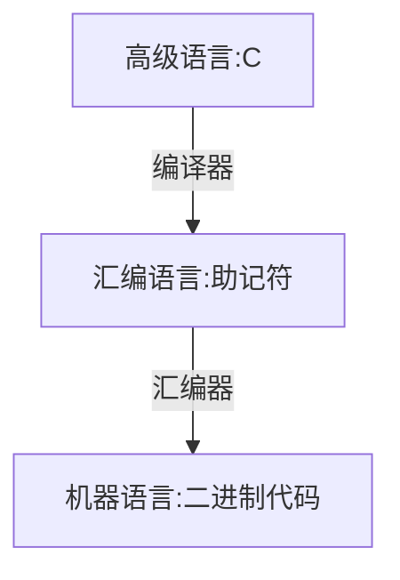

# 高级语言与机器级代码之间的对应
Top:: [[Computer Compose]] - 第四章 - 指令系统 - 4.3.1

- 考试要求：
	- 只需要关注 x86 汇编语言
	- 能结合 C 语言看懂汇编语言的关键语句（常见指令、选择结构、循环结构、函数调用）
	- 能结合汇编语言分析机器语言指令的格式、寻址方式

## x86 汇编语言指令基础
---
- 指令的作用
	- 改变程序执行流
	- 处理数据
- 指令格式：
	- 操作码
		- 怎么处理？
	- 地址码
		- 数据在哪儿？
			- 在寄存器里
				- 指令中给出 " 寄存器名 "
				- 指令中给出 " 主存地址 "
				- 指令中给出要操作的数，也就是 " 立即寻址 "
			- 在主存里
			- 在指令里
   
## 以 mov 指令为例
---
- mov 目的操作数 d, 源操作数 s
	- mov 指令功能: 将源操作数 s 复制到目的操作数 d 所指的位置
	- `mov eax, ebx`
		- 将寄存器 ebx 的值复制到寄存器 eax
	- `mov eax, 5`
		- 将立即数 5 复制到寄存器 eax
	- `mov eax, dword ptr[af996h]`
		- 将内存地址 af996h 所指的 32bit 值复制到寄存器 eax
	- `mov byte ptr[af996h], 5`
		- 将立即数 5 复制到内存地址 af996h 所指的一字节中

## x86 中的常用寄存器
---
- 通用寄存器
	- （X = 未知，E = Extended = 32bit）
	- EAX
	- EBX
	- ECX
	- EDX
- 变址寄存器
	- （S = Source, D = Destination)
	- 可用于线性表、字符串的处理
	- ESI
	- EDI
- 堆栈指针
	- （Base Pointer, Stack Pointer)
	- 用于实现函数调用
	- EBP
	- ESP
	 
## 更多例子
---
- `mov eax, dword ptr[ebx]`
	- 将 ebx 所指主存地址的 32bit 复制到 eax 寄存器中
- `mov dword ptr[ebx], eax`
	- 将 eax 的内容复制到 ebx 所指主存地址的 32bit
- `mov eax, byte ptr [ebx]`
	- 将 ebx 所指的主存地址的 8bit 复制到 eax
- `mov eax, [ebx]`
	- 若未指明主存读写长度,默认 32bit
- `mov [af996h], eax`
	- 将 eax 的内容复制到 af996h 所指的地址 (未指明长度默 32bit)
- `mov eax, dword ptr [ebx+8]`
	- 将 ebx+8 所指主存地址的 32bit 复制到 eax 寄存器中
- `mov eax, dword ptr [af996-12h]`
	- 将 af996-12 所指主存地址的 32bit 复制到 eax 寄存器中
