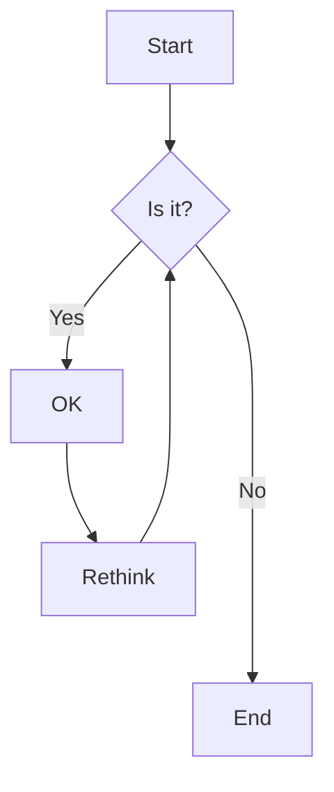

# Mermaid

## Introduce
---
Mermaid 是一种基于 Markdown 的画图语言，用于在文本中创建流程图、时序图、甘特图等各种图表。它通过简单的文本描述来生成可视化的图形表示，使得在文档中插入图表变得非常便捷。

由于 Mermaid 是基于 Markdown 语法的扩展，因此无需额外安装软件或插件即可在支持 Markdown 的编辑器或平台上使用。这种简单易用的特点使得 Mermaid 成为了许多开发者、写作人员以及团队协作中常用的工具之一。

## 语法介绍
---
### Flowchart

首先来看一段 mermaid flowchart 样例

- **\`\`\` mermaid**
	- 要使用 Mermaid, 首先要在 Markdown 中当中, 输入来连续三个飘号 (数字 1 左边的那个键) 来插入一个代码块, 并在飘号后写下 `mermaid` 来让编辑器知道这是一段 mermaid.
- **flowchart TD**
	- mermaid 支持很多画图格式, 需要在第一行声明自己画的是什么图
		- 这里表示我们画的是 flowchart(流程图)
	- TD 表示画图的方向是从上 (Top) 到下 (Down)
		- 其他画图的方向还有
			- BT: 从下 (Bottom) 到上 (Top)
			- LR: 从左 (Left) 到右 (Right)
			- RL: 从右 (Right) 到左 (Left)
- **A\\\[Start] --> B{Is it?}**
	- A 和 B 代表这一对象的名称, 之后其他对象需要连接到这两个对象时, 只要使用 A B 就行了
	- \\\[Start] {Is it?}
		- Start 是 A 的内容, Is it? 是 B 的内容
		- \\\[] 代表 A 的样式为方形 , {} 代表 B 的样式为菱形
- **B -->|Yes| C\[OK\]**
	- |Yes| 代表在连接线上的注释
	- 也可以写成 **--Yes-->**

### ClassDiagram

类图 (ClassDiagram), 用于表示程序设计中各个类之间的关系
在 Mermaid 中, ClassDiagram 与 Flowchart 有着完全不兼容的语法 (我倒是希望这两个能合并一下)

## Relative
---
- Obsidian_MermaidTools
	- Obsidian 插件，提供可视化的控件，快速插入 Mermaid 语句，并且可以自己设定控件

## Resources
---
- [Flowcharts - Basic Syntax](https://mermaid.js.org/syntax/flowchart.html)
	- 官网教程
	- 这是 Flowcharts 的教程，但是在左边目录可以导航到其他模式的教程
- https://www.mermaidchart.com/app/dashboard
	- 一个在线的 Mermaid 编辑器
	- 有趣的是可以用 AI 生成 Mermaid (大势所趋!)
