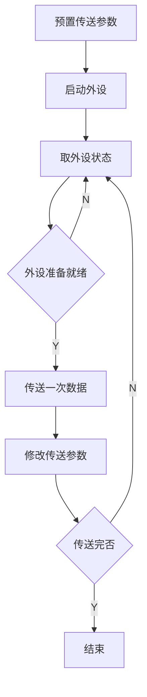

# 程序查询方式

Top :: [[王道 - 计算机组成原理]] - 第七章 - 输入输出系统 - 7.3.1

- x86 中的 IO 指令实例
	- IN Rd,Rs:
		- 把 IO 端口 Rs 的数据输入到 CPU 寄存器 Rd
	- OUT Rd,Rs:
		- 把 CPU 寄存器 Rs 的数据输出到 IO 端口 Rd

## 程序查询方式流程图
---

- 优点:
	- 接口设计简单、设备量少。
- 缺点:
	- CPU 在信息传送过程中要花费很多时间用于查询和等待,而且在一段时间内只能和一台外设交换信息,效率大大降低。
